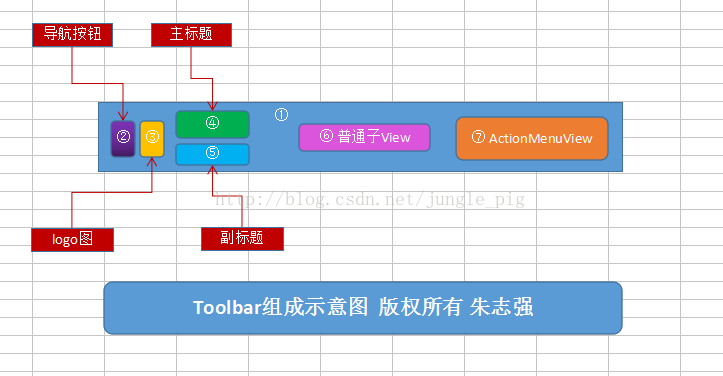

# Toolbar使用

原博客地址[朱志强的博客-随心所欲定制Toolbar](https://blog.csdn.net/jungle_pig/article/details/52785781)

> 主要构造


①为Toolbar，继承ViewGroup，是个普通的容器。

②为导航按钮，类型为ImageButton，可设置点击事件，用于返回上个页面或者滑出侧滑菜单。

    xml属性：app:navigationIcon 对应方法：setNavigationIcon(Drawable d) ，setNavigationIcon(int resId)

③为Logo展示图，类型为ImageView，不响应事件，仅仅作为展示。

    xml属性：app:logo 对应方法：setLogo(Drawable d) ，setLogo(int resId)

④为主标题，类型为TextView

    xml属性：app:title 对应方法：setTitle(CharSequence title)，setTitle(int resId)

⑤为副标题，类型为TextView

    xml属性：app:subtitle 对应方法：setSubtitle(CharSequence title)，setSubtitle(int resId)

⑥为普通子View，标题和ActionMenuView之间是留给我们添加子View的区域

⑦为ActionMenuView,负责管理选项菜单

```xml
<?xml version="1.0" encoding="utf-8"?>  
<LinearLayout  
    xmlns:android="http://schemas.android.com/apk/res/android"  
    xmlns:app="http://schemas.android.com/apk/res-auto"  
    xmlns:tools="http://schemas.android.com/tools"  
    android:layout_width="match_parent"  
    android:layout_height="match_parent"  
    android:orientation="vertical"  
    tools:context="coder.zzq.toolbardemo.MainActivity">  
    <android.support.v7.widget.Toolbar  
        android:id="@+id/toolbar"  
        android:layout_width="match_parent"  
        android:layout_height="?attr/actionBarSize"  
        android:background="@color/colorPrimary"  
        app:navigationIcon="@drawable/nav_icon"  
        app:logo="@drawable/logo_icon"  
        app:title="主标题"  
        app:subtitle="副标题">  
        <TextView  
            android:layout_width="wrap_content"  
            android:layout_height="wrap_content"  
            android:textSize="16sp"  
            android:padding="4dp"  
            android:text="普通子View"  
            android:id="@+id/free_child"  
            android:layout_gravity="center"  
            android:background="#ffffff"/>  
    </android.support.v7.widget.Toolbar>  
</LinearLayout>  
```

```java
//像获取普通控件那样获取Toolbar  
mToolbar = (Toolbar) findViewById(R.id.toolbar);  
  
//以下四个方法分别用来设置导航按钮、Logo、主标题和副标题  
//如果xml文件中没有设置这些属性或者想覆盖xml文件中设置的值可调用这些方法  
mToolbar.setNavigationIcon(R.drawable.nav_icon);  
mToolbar.setLogo(R.drawable.logo_icon);  
mToolbar.setTitle("主标题");  
mToolbar.setSubtitle("副标题");  

//设置导航按钮的点击事件  
mToolbar.setNavigationOnClickListener(new View.OnClickListener() {  
    @Override  
    public void onClick(View v) {  
        Toast.makeText(MainActivity.this, "点击了导航按钮！", Toast.LENGTH_SHORT).show();  
    }  
}); 

//生成选项菜单  
mToolbar.inflateMenu(R.menu.action_menu_main);  
//设置选项菜单的菜单项的点击事件  
mToolbar.setOnMenuItemClickListener(new Toolbar.OnMenuItemClickListener() {  
    @Override  
    public boolean onMenuItemClick(MenuItem item) {  
        Toast.makeText(MainActivity.this, "点击了菜单项" + item.getTitle(), Toast.LENGTH_SHORT).show();  
        return true;  
    }  
});  
  
//获取选项菜单,可增加，减少菜单项  
Menu menu = mToolbar.getMenu();  
menu.add("测试菜单项");  
menu.removeItem(R.id.item_04);  
  
//设置溢出菜单的icon，显示、隐藏溢出菜单弹出的窗口  
mToolbar.setOverflowIcon(ContextCompat.getDrawable(this,android.R.drawable.ic_menu_more));  
mToolbar.showOverflowMenu();  
mToolbar.dismissPopupMenus(); 
```

## Toobar使用

1. 导航按钮的左右间距问题

```xml

<!-- 原始的Navigation的样式 -->
    <style name="Base.Widget.AppCompat.Toolbar.Button.Navigation" parent="android:Widget">
        <item name="android:background">?attr/controlBackground</item>
        <item name="android:minWidth">56dp</item>
        <item name="android:scaleType">center</item>
    </style>

<!-- 我们可以自定义样式 -->
    <style name="m_navigation" parent="Base.Widget.AppCompat.Toolbar.Button.Navigation">
        <item name="android:background">?attr/controlBackground</item>
        <item name="android:minWidth">56dp</item>
        <item name="android:scaleType">center</item>
    </style>

<!-- 使用 -->
    <style name="AppTheme" parent="Theme.AppCompat.Light.NoActionBar">
        <!-- Customize your theme here. -->
        <item name="m_navigation">@style/m_navigation</item>
    </style>
```

2. 标题文字的大小和颜色

```xml

<!-- 定义 -->
<style name="toolbar_title_style">  
    <item name="android:textColor">#ffffff</item>  
    <item name="android:textSize">20sp</item>  
</style>  

<!-- 使用 -->
app:titleTextAppearance="@style/toolbar_title_style"
```

3. 标题居中问题

```xml
<android.support.v7.widget.Toolbar  
    android:id="@+id/toolbar"  
    android:layout_width="match_parent"  
    android:layout_height="?attr/actionBarSize"  
    android:background="@color/colorPrimary"  
    app:navigationIcon="@drawable/nav_icon"  
    app:contentInsetStart="0dp"  
    app:contentInsetStartWithNavigation="0dp"  
    >  
    <TextView  
        android:layout_width="wrap_content"  
        android:layout_height="wrap_content"  
        android:text="标题"  
        android:textColor="#ffffff"  
        android:textSize="20sp"  
        android:layout_gravity="center"/>  
    </android.support.v7.widget.Toolbar>  
```

4. 自定义弹出的溢出菜单的背景、弹出位置

```xml

<!-- 默认样式 -->
<style name="Base.Widget.AppCompat.Light.PopupMenu.Overflow">  
    <item name="overlapAnchor">true</item>  
    <item name="android:dropDownHorizontalOffset">-4dip</item>  
</style>  

<!-- 自定义样式 -->
<style name="toolbar_action_menu_overflow" parent="Widget.AppCompat.Light.PopupMenu.Overflow">  
    <!-- 是否覆盖锚点，为true则盖住Toolbar -->  
    <item name="overlapAnchor">false</item>  
    <!-- 弹出层水平方向上的偏移，即距离屏幕左边的距离，负值会导致右边出现空隙 -->  
    <item name="android:dropDownHorizontalOffset">-2dp</item>  
    <!-- 弹出层垂直方向上的偏移，即在竖直方向上距离Toolbar的距离，值为负则会盖住Toolbar -->  
    <item name="android:dropDownVerticalOffset">4dp</item>  
    <!-- 弹出层背景颜色 -->  
    <item name="android:popupBackground">@color/colorPrimary</item>  
</style>  

<!-- 覆盖 -->
<style name="AppTheme" parent="Theme.AppCompat.Light.NoActionBar">  
    <!-- Customize your theme here. -->  
    <item name="actionOverflowMenuStyle">@style/toolbar_action_menu_overflow</item>  
</style>  

<!-- 字体的颜色和大小通过Toolbar的xml属性app:popupTheme="@style/toolbar_pop_theme"指定 -->
<style name="toolbar_pop_theme">  
    <item name="android:textColor">#ffffff</item>  
    <item name="android:textSize">16sp</item>  
</style>  
```