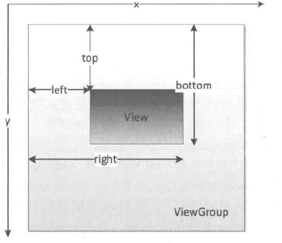

# View的时间体系

## 基础知识

+ View的位置参数
+ MotionEvent
+ TouchSlop
+ VelocityTracker
+ GestureDetector
+ Scroller

### View的位置参数
> View的位置参数图片参考(android开发艺术探索)


```java
//  获取View在ViewGroup里面的位置 3.0之前的位置参数
//  顶点的位置值是固定不变的
left=getLeft();
top=getTop();
right=getRight();
bottom=getBottom();
width=right-left;
height=bottom-top;

//  3.0之后的位置参数

//  对应左上角的坐标
x=getX(); //  初始等于left
y=getY();  // 初始等于top

//  左上角相对于ViewGroup的偏移量
translationX=getTranslationX(); //X移动
translationY=getTranlationY(); // y移动
//  移动之后
x=left+translationX;
y=top+translationY;
```

### MotionEvent 触摸事件

> 常用的三个事件
+ ACTION_DOWN
+ ACTION_MOVE
+ ACTION_UP 

一般情况下有这两种情况的手势
+ 点击屏幕后离屏幕
  + DOWN-UP
+ 点击屏幕之后滑动之后离开屏幕
  + DOWN-MOVE...MOVE-UP

> 获取触摸位置的方法
```java
//  相对于所在View
event.getX(); //  相对于View左上角
event.getY();

//  相对于屏幕
event.getRawX();  //  相对于手机屏幕左上角？是否包含statusBar
event.getRawY();
```

### TouchSlop 滑动的最小距离

> 是系统所能识别出的被认为是滑动的最小距离，就是如果滑动的距离小于这个值，则系统不认为此次是滑动，就是变为DOWN-UP，不会触发MOVE事件吗？，该值根据系统的不同可能不同。

获取这个值：
```java
ViewConfiguration.get(getContext()).getScaledTouchSlop();
```

### VelocityTracker 速度追踪

> 一般用在onTouchEvent()中追踪滑动的速度，指的是一段时间内滑过的像素点，即像素点除以时间为速度【匀速运动】，有正负之分，从右向左滑动时候为负值，下到上滑动时候为负值

使用方式：
```java
VelocityTracker velocityTracker=VelocityTracker.obtian();
velocityTracker.addMovement(event);
velocityTracker.computeCurrentVelocity(1000); //  1000表示事件ms,此处如果实际的时间没有达到1000，系统会怎么处理
int xVelocity=velocityTracker.getXVelocity(); //  获取x方向的速度
int yVelocity=velocityTracker.getYVelocity(); //  获取y方向的速度

//  回收
velocityTracker.clear();
velocityTracker.recycle();
```

### GestureDetector 手势

> view的手势处理，如何使用
```java
GestureDetector gestureDetector;

//  需要所在View实现它的两个接口
gestureDetector=new GestureDetector(context,this);

//  接口1
    public interface OnGestureListener {

        //  ACTION_DOWN 这个方法返回true 才会处理后续的事件
        boolean onDown(MotionEvent var1);

        void onShowPress(MotionEvent var1);

        //  onDown()方法返回true，如果是单点触摸后抬起，会触发这个事件
        boolean onSingleTapUp(MotionEvent var1);

        //  onDown()返回true，滑动的话会一直触发这个事件
        boolean onScroll(MotionEvent var1, MotionEvent var2, float var3, float var4);

        //  当触发这个事件之后，如果接着滑动，不会在触发onScroll事件
        void onLongPress(MotionEvent var1);

        //  onDown()返回true,如果手指抬起瞬间又快速滑动的操作，会触发这个事件
        //  var1 action_down的MotionEvent 每次移动var2移动的actionEvent，var3 x轴滑动距离,var4 y轴滑动距离
        boolean onFling(MotionEvent var1, MotionEvent var2, float var3, float var4);
    }

//  接口2
    public interface OnDoubleTapListener {
      //  onDown()方法返回true，如果是单点触摸后抬起，会触发这个事件
        boolean onSingleTapConfirmed(MotionEvent var1);

        boolean onDoubleTap(MotionEvent var1);

        boolean onDoubleTapEvent(MotionEvent var1);
    }

//  以下为onDown返回true时候的一些后续操作
//  单击
E/com.ltw.book.view.CustomTextView: onDown
E/com.ltw.book.view.CustomTextView: onSingleTapUp
E/com.ltw.book.view.CustomTextView: onSingleTapConfirmed

//  触摸之后平滑滑动
E/com.ltw.book.view.CustomTextView: onDown
E/com.ltw.book.view.CustomTextView: onShowPress
E/com.ltw.book.view.CustomTextView: onScroll
E/com.ltw.book.view.CustomTextView: onScroll

//  触摸之后，抬起瞬间快速滑动
E/com.ltw.book.view.CustomTextView: onDown
E/com.ltw.book.view.CustomTextView: onScroll
E/com.ltw.book.view.CustomTextView: onScroll
E/com.ltw.book.view.CustomTextView: onFling

//  双击
E/com.ltw.book.view.CustomTextView: onDown
E/com.ltw.book.view.CustomTextView: onSingleTapUp
E/com.ltw.book.view.CustomTextView: onDoubleTap
E/com.ltw.book.view.CustomTextView: onDoubleTapEvent
E/com.ltw.book.view.CustomTextView: onDown
E/com.ltw.book.view.CustomTextView: onDoubleTapEvent

//  长按
E/com.ltw.book.view.CustomTextView: onDown
E/com.ltw.book.view.CustomTextView: onShowPress
E/com.ltw.book.view.CustomTextView: onLongPress
```

### Scroller

> 如果使用View的scrollTo(),scrollBy(),滑动过程是瞬间完成的，而配合Scroller使用，可以有平滑的过度效果，但是Scroller需要配合View的computeScroll使用
> 不管是scrollTo()还是scrollBy()方法，滚动的都是该View内部的内容。 
> 就是两个scroll方法中传入的参数，第一个参数x表示相对于当前位置横向移动的距离，正值向左移动，负值向右移动，单位是像素。第二个参数y表示相对于当前位置纵向移动的距离，正值向上移动，负值向下移动，单位是像素。

```java
//  scroller的使用

    /**
     *@param destX x轴滑动的距离
     *@param destY y轴滑动的距离
     **/
    void smoothScrollTo(int destX,int destY){
        int scroll=getScrollY();  //获取当前的滚动距离
        scroller.startScroll(0,scroll,0,destY,1000);  //x的开始滚动位置 y的开始滚动位置 移动距离 移动时间
        invalidate();
    }

//  配合view的防范使用
    @Override
    public void computeScroll() {
        
        //  判断移交给scroller的移动距离是否已经完结
        if (scroller.computeScrollOffset()){
            
            //  获取当前当前的滚动位置，绝对位置
            //  startX+ratio*destX=scroller.getCurrX()
            scrollTo(scroller.getCurrX(),scroller.getCurrY());
            postInvalidate();
        }
    }
```

## 事件的传递机制

> 三个方法
```java

```