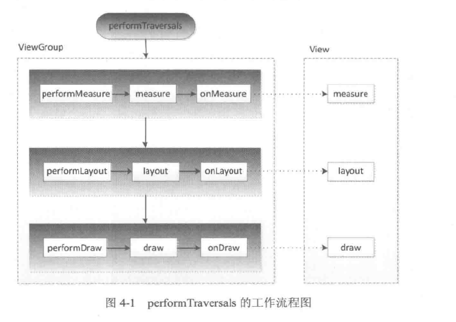
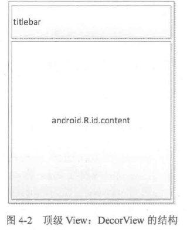
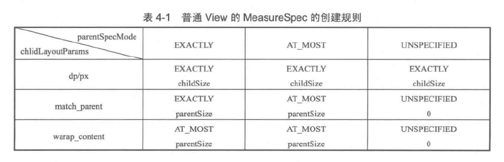

# view的工作原理

##  ViewRoot

> ViewRoot对应于ViewRootImpl类，是WindowManager和DecorView连接的关键点，view的三大流程都是通过ViewRoot来完成的,在ActivityThread中，当Activity创建完毕之后，DecorView添加进Window中，同事创建ViewRootImpl对象，并将ViewRootImpl对象和DecorView建立关联->【android开发艺术探索】

> 绘制流程


measure的过程决定了View的宽高，之后可以通过getMeasureWidth和getMeasureHeight来获取宽高，集合所有的情况下都等于getWidth和getHeight的值，draw方法完成之后视图呈现在屏幕上。

> DecorView的结构


```java {.line-numbers}
//  获取content
ViewGroup content=findViewById(R.android.id.content);// 如果和我们定义的冲突怎么办？

//  获取我们个根视图
View view=content.getChildAt(0);
```

## MeasureSpec

> 决定视图尺寸，视图的measureSpec会受到ViewGroup的影响，在测量过程中，系统会想View的LayoutParams根据父容器的规则转换（？）。是一个32位的int值，高2位表示SpecModel（测量模式），低30位表示SpecSize（测量尺寸）
==视图的measureSpec会受到ViewGroup的影响==
```java {.line-numbers}
//  size位
private static final int MODE_SHIFT=30;
//  标志位11+32个0
private static final int MODE_MASK=0x3<<MODE_SHIFT;
// 00 表示不限定测量模式 有多大就多大
private static final int UNSPECIFIED=0<<MODE_SHIFT;
// 01 精确测量模式  view 的最终大小有specisze决定----match_parent 和 具体的大小
private static final int EXACTLY=1<<MODE_SHIFT;
// 10 芙蓉器提供一个最大的值，view 的大小不能超过这个值，具体看view的数值  ---wrap_content 
private static final int AT_MOST=2<<MODE_SHIFT;

public static int getMode(int measureSpec) {
    //noinspection ResourceType
    //  避免判断分支过程 直接用位操作符
    //  mask后30位都为0 任何数与都为0
    return (measureSpec & MODE_MASK);
}

public static int getSize(int measureSpec) {
  //  获取size位为1的值 
  //  取反 后30为1 只有与位为1菜返回1
    return (measureSpec & ~MODE_MASK);
}

```

具体测量规则->摘自【android开发艺术探索】


## view的工作流程

> 通过measure测量宽高，layout确定四个顶点的位置，draw绘制。

### view的测量过程

```java {.line-numbers}

//  是否有设置最小值
case R.styleable.View_minWidth:
     mMinWidth = a.getDimensionPixelSize(attr, 0);
     break;
case R.styleable.View_minHeight:
     mMinHeight = a.getDimensionPixelSize(attr, 0);
    break;

//  view的测量方法
    protected void onMeasure(int widthMeasureSpec, int heightMeasureSpec) {
        setMeasuredDimension(getDefaultSize(getSuggestedMinimumWidth(), widthMeasureSpec),
                getDefaultSize(getSuggestedMinimumHeight(), heightMeasureSpec));
    }

    protected int getSuggestedMinimumWidth() {
        return (mBackground == null) ? mMinWidth : max(mMinWidth, mBackground.getMinimumWidth());
    }

//  drawable的getMinimumWidth方法
    /**
     * Returns the minimum width suggested by this Drawable. If a View uses this
     * Drawable as a background, it is suggested that the View use at least this
     * value for its width. (There will be some scenarios where this will not be
     * possible.) This value should INCLUDE any padding.
     *
     * @return The minimum width suggested by this Drawable. If this Drawable
     *         doesn't have a suggested minimum width, 0 is returned.
     */
     // shapeDrawable无原始宽高
     // bitmapDrawable有原始宽高 -图片的尺寸
    public int getMinimumWidth() {
        final int intrinsicWidth = getIntrinsicWidth();
        return intrinsicWidth > 0 ? intrinsicWidth : 0;
    }

//  默认尺寸
    public static int getDefaultSize(int size, int measureSpec) {
        //  默认尺寸为最小值
        int result = size;
        //  获取测量模式
        int specMode = MeasureSpec.getMode(measureSpec);
        //  获取尺寸
        int specSize = MeasureSpec.getSize(measureSpec);

        switch (specMode) {
        case MeasureSpec.UNSPECIFIED:
            result = size;
            break;
        
        //  如果测量模式为下面两个的 则统一处理
        //  更具前面的提到的子视图的测量模式有自己和父视图决定，当view的测量模式为下面两种的时候，的尺寸都是parentSize,所以当我们需要自定义视图的时候是需要重写onMeasure方法来修改他的默认行为达到我们的目的
        case MeasureSpec.AT_MOST:
        case MeasureSpec.EXACTLY:
            result = specSize;
            break;
        }
        return result;
    }

//  具体实
@override
protect void onMesure(int widthMeasureSpec,int heightMeasureSpec){
  int widthSpecMode=MeasureSpec.getMode(widthMeasureSpec);
  int widthSpecSize=MeasureSpec.getMode(widthMeasureSpec);
  int heightSpecMode=MeasureSpec.getMode(heightMeasureSpec);
  int heightSpecSize=MeasureSpec.getMode(heightMeasureSpec);
  
  //  自己设置默认值
  int defaultWidth=200;
  int defaultHeight=200;
  if(widthSpecMode==MeasureSpec.At_MOST&&heightSpecMode==MeasureSpec.At_MOST){
    setMeasuredDimension(defaultWidth,defaultHeight)
  }else if(widthSpecMode==MeasureSpec.At_MOST){
     setMeasuredDimension(defaultWidth,heightSpecSize)
  }else{
    setMeasuredDimension(widthSpecSize,heightSpecSize)
  }
}

```

### ViewGroup的测量过程

> 对于Viewgroup的测量过程，除了要测量自己之外，还需要变量所有的child，并且完成他们的测量，提供了一个measureChildren的方法来测量子视图的方法。onMeasure为空实现，需要各自的布局自定义

```java {.line-numbers}

//  测量子视图的方法
    protected void measureChildren(int widthMeasureSpec, int heightMeasureSpec) {
        final int size = mChildrenCount;
        final View[] children = mChildren;
        for (int i = 0; i < size; ++i) {
            final View child = children[i];
            if ((child.mViewFlags & VISIBILITY_MASK) != GONE) {
                measureChild(child, widthMeasureSpec, heightMeasureSpec);
            }
        }
    }

    protected void measureChild(View child, int parentWidthMeasureSpec,
            int parentHeightMeasureSpec) {
        
        //  获取view的布局参数
        final LayoutParams lp = child.getLayoutParams();

        //  获取view的宽度测量模式
        final int childWidthMeasureSpec = getChildMeasureSpec(parentWidthMeasureSpec,
                mPaddingLeft + mPaddingRight, lp.width);
        //  获取view的高度测量模式
        final int childHeightMeasureSpec = getChildMeasureSpec(parentHeightMeasureSpec,
                mPaddingTop + mPaddingBottom, lp.height);

        //  调用view的测量方法 -之后同上
        child.measure(childWidthMeasureSpec, childHeightMeasureSpec);
    }
```

> onMeasure可能会多次测量，所以在这里获取宽高可能会不准确，比较好的方式是在onLayout里面去获取宽高。由于View的测量过程和activity的生命周期不是同步的，因此在某些生命钩子里面去获取view的宽高可能获取的情况。可以通过以下几种方式在activity中区获取view的size

+ onWindowFocusChanged()
  + 该方法表示view已经初始化完毕，可以测量了。需要注意，该方法在activity失去和得到焦点的时候都会执行一次，不要再里面执行耗时的方法。
```java {.line-numbers}
public void onWindowFoucsChanged(boolean hasFocus){
  if(hasFocus){
    int width=view.getMeasureWidth();
  }
}
```
+ view.post(runnable)
  + 通过post将一个runnable投递到view的消息队列里面，等待looper调用此runnable的时候，表示view已经初始化好了。
```java {.line-numbers}
protected void onStart(){
  supre.onStart();
  view.post(new Runnable{
    @override
    public void run(){
      int width=view.getMeasureWidth();
    }
  })
}
```
+ ViewTreeObserver
  + 使用observer的回调可以实现。之一，OnGlobalLayoutListener接口，当View树的状态发生改变的时候会调用onGlobalLayout（是否会多次调用-）。
```java {.line-numbers}
protected void onStart(){
  supre.onStart();
  ViewTreeObserver observer=view.getViewTreeObserver();
  observer.addOnGlobleLayoutListener(new OnGlobleLayoutListener(){
    view.getViewTreeObserver.removeGlobalOnLayoutListener(this);
    int width=view.getMeasureWidth();
  })
}
```