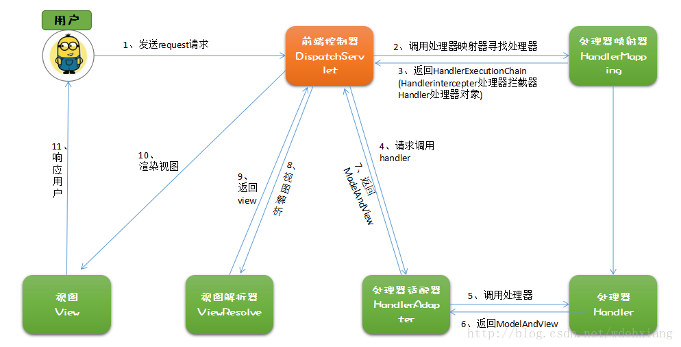

# springMVC 的配置过程

[https://docs.spring.io/spring/docs/current/spring-framework-reference/web.html#mvc](https://docs.spring.io/spring/docs/current/spring-framework-reference/web.html#mvc)

## 工作过程

[图片来源](https://blog.csdn.net/wdehxiang/article/details/77619512)



SpringMVC 流程:

1. 用户发送请求至前端控制器 DispatcherServlet。
2. DispatcherServlet 收到请求调用 HandlerMapping 处理器映射器。
3. 处理器映射器找到具体的处理器(可以根据 xml 配置、注解进行查找)，生成处理器对象及处理器拦截器(如果有则生成)一并返回给 DispatcherServlet。
4. DispatcherServlet 调用 HandlerAdapter 处理器适配器。
5. HandlerAdapter 经过适配调用具体的处理器(Controller，也叫后端控制器)。
6. Controller 执行完成返回 ModelAndView。
7. HandlerAdapter 将 controller 执行结果 ModelAndView 返回给 DispatcherServlet。
8. DispatcherServlet 将 ModelAndView 传给 ViewReslover 视图解析器。
9. ViewReslover 解析后返回具体 View。
10. DispatcherServlet 根据 View 进行渲染视图（即将模型数据填充至视图中）。
11. DispatcherServlet 响应用户。

## 注解

- @Controller
  - 标识这个类为一个 SpringMVC 控制器
- @requestMapping(path)
  - 标识路由导航，可用于 controller 和 method
  - param
    - path
      - String
    - ## method
  - question
    - 是否有默认的方法。如果某个 controller 定义了 requestMapping 但是方法没有一个定义了 requestMapping，controller 如何处理？
- @RequestBody
  - 该注解用于读取 Request 请求的 body 部分数据，使用系统默认配置的 HttpMessageConverter 进行解析，然后把相应的数据绑定到要返回的对象上 ,再把 HttpMessageConverter 返回的对象数据绑定到 controller 中方法的参数上
- @ResponseBody
  - 该注解用于将 Controller 的方法返回的对象，通过适当的 HttpMessageConverter 转换为指定格式后，写入到 Response 对象的 body 数据区
- @RequestParam
  - 在处理方法入参处使用 @RequestParam 可以把请求参 数传递给请求方法
- @getMapping
  - get 请求？
- @PathVariable
  - 绑定 URL 占位符到入参
- @ExceptionHandler
  - 注解到方法上，出现异常时会执行该方法
- @ControllerAdvice
  - 使一个 Contoller 成为全局的异常处理类，类中用@ExceptionHandler 方法注解的方法可以处理所有 Controller 发生的异常

```java
// usage
@Controller
@RequestMapping("/person")
public class Person{

  @RequestMapping("/get")
  public Person getPersion(@RequestParam(value="name") String name){
    //  println name
  }

  @RequestMapping("/get/{id}")
  public String test(@PathVariable String id){
      System.out.println(id);
      return "test";
  }
}
```

## web.xml

```xml
<?xml version="1.0" encoding="UTF-8"?>
<web-app
  version="2.4"
  xmlns="http://java.sun.com/xml/ns/j2ee"
  xmlns:xsi="http://www.w3.org/2001/XMLSchema-instance"
  xsi:schemaLocation="http://java.sun.com/xml/ns/j2ee
	http://java.sun.com/xml/ns/j2ee/web-app_2_4.xsd"
>
  <servlet>
    <servlet-name>app1</servlet-name>
    <servlet-class
      >org.springframework.web.servlet.DispatcherServlet</servlet-class
    >
    <init-param>
      <param-name>contextConfigLocation</param-name>
      <param-value>/WEB-INF/app1-context.xml</param-value>
    </init-param>
    <!-- springMVC的配置文件所在位置 如下;;可以使用变量 classpath表示项目所在的src目录下 -->
    <!--
      <init-param>
        <param-name>contextConfigLocation</param-name>
        <param-value>classpath:springmvc-servlet.xml</param-value>
      </init-param>
    -->
    <load-on-startup>1</load-on-startup>
  </servlet>

  <servlet-mapping>
    <servlet-name>app1</servlet-name>
    <url-pattern>/app1/*</url-pattern>
  </servlet-mapping>
  <welcome-file-list>
    <welcome-file>index.html</welcome-file>
  </welcome-file-list>
</web-app>
```

## springMVC-servlet

SpringMVC 的配置文件。可以配置转换器、拦截器、视图解析器等。

### 内置 bean

[默认的 bean](https://github.com/spring-projects/spring-framework/blob/master/spring-webmvc/src/main/resources/org/springframework/web/servlet/DispatcherServlet.properties)

> DispatchServlet

前端控制器，SpringMVC 的中心，所以的一切都是围绕这个 servlet 来展开，协调各个部分完成客户端的请求。

> HandlerMapping

实现类有【RequestMappingHandlerMapping】和【SimpleUrlHandlerMapping】.
其中【RequestMappingHandlerMapping】支持使用注解【@RequestMapping】映射路由。而【SimpleUrlHandlerMapping】是通过 uri 来定位注册方法的？

> HandlerAdapter

> HandlerExceptionResolver

> ViewResolver

> LocaleResolver

> ThemeResolver

> MultipartResolver

> FlashMapManager

```xml
<?xml version="1.0" encoding="UTF-8"?>
<beans xmlns="http://www.springframework.org/schema/beans"
    xmlns:xsi="http://www.w3.org/2001/XMLSchema-instance"
    xmlns:context="http://www.springframework.org/schema/context"
    xmlns:mvc="http://www.springframework.org/schema/mvc"
    xsi:schemaLocation="http://www.springframework.org/schema/beans http://www.springframework.org/schema/beans/spring-beans.xsd
        http://www.springframework.org/schema/context http://www.springframework.org/schema/context/spring-context-4.1.xsd
        http://www.springframework.org/schema/mvc http://www.springframework.org/schema/mvc/spring-mvc-4.1.xsd">

    <!-- springMVC会扫描指定的包和子包的java文件 -->
    <!-- 如果要扫描多个包，多个包中间使用半角逗号分隔 -->
    <context:component-scan base-package="com.wholler.tk.controller"/>

    <!-- don't handle the static resource -->
    <!-- 默认servlet不导航静态文件？ -->
    <mvc:default-servlet-handler />

    <!-- 是否启用注解 如果启用注解需要加上 -->
    <mvc:annotation-driven />

    <!-- 映射jsp文件 -->
    <bean class="org.springframework.web.servlet.view.InternalResourceViewResolver"
            id="internalResourceViewResolver">
        <!-- 前缀 -->
        <property name="prefix" value="/WEB-INF/jsp/" />
        <!-- 后缀 -->
        <property name="suffix" value=".jsp" />
    </bean>
</beans>
```

## 配置 json

```xml
<!-- 在 pom.xml 里面加入这两个依赖 -->
<dependency>
  <groupId>com.fasterxml.jackson.core</groupId>
  <artifactId>jackson-databind</artifactId> <version>2.9.7</version>
</dependency>
<!--
  https://mvnrepository.com/artifact/com.fasterxml.jackson.core/jackson-core
-->
<dependency>
  <groupId>com.fasterxml.jackson.core</groupId>
  <artifactId>jackson-core</artifactId> <version>2.9.7</version>
</dependency>

<!-- springMVC-context.xml -->
<mvc:annotation-driven>
  <mvc:message-converters>
    <bean
      class="org.springframework.http.converter.StringHttpMessageConverter"
    />
    <bean
      class="org.springframework.http.converter.json.MappingJackson2HttpMessageConverter"
    />
  </mvc:message-converters>
</mvc:annotation-driven>
```
