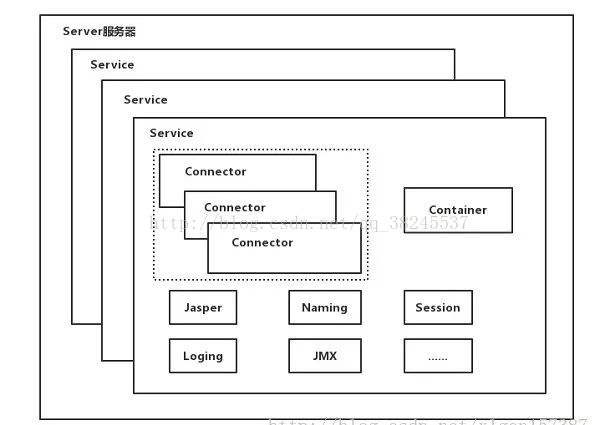

# tomcat 配置

## 架构

[https://blog.csdn.net/qq_38245537/article/details/79009448](https://blog.csdn.net/qq_38245537/article/details/79009448)

架构图：

1. Server 是顶层容器，代表整个服务器，每个 Server 可以包含多个 Service
2. Service 是多个 connector 和一个 container 的容器，代表一个具体的服务，定义了 Service、connector、container 就可以对外提供服务了
3. 每个 connector 负责监听一个端口来处理不同的请求，如 http 请求，ajp 请求。然后把请求转发给相关的 engine
4. container
